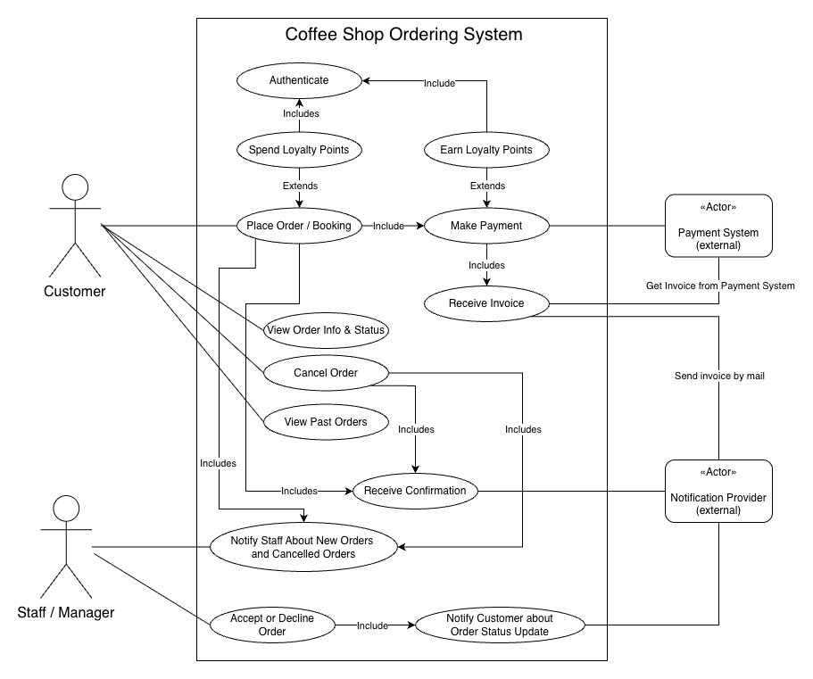
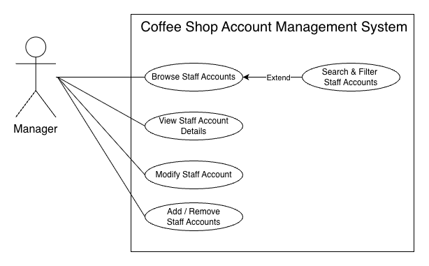
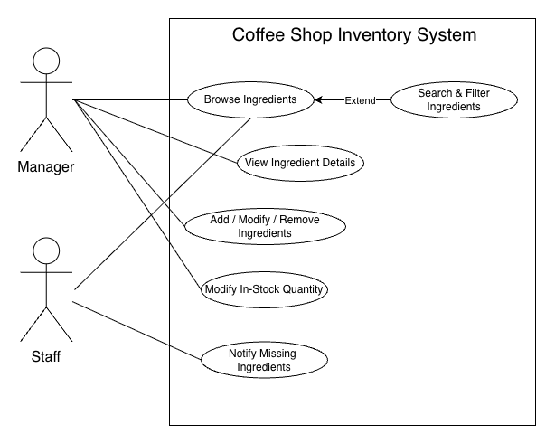
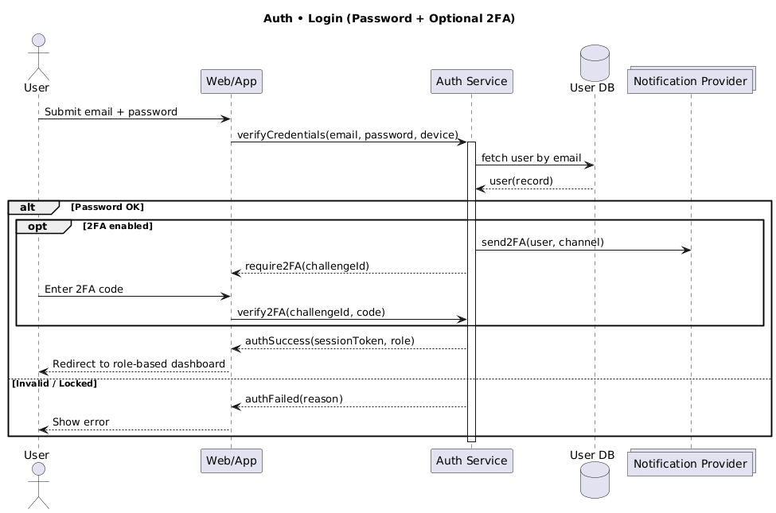
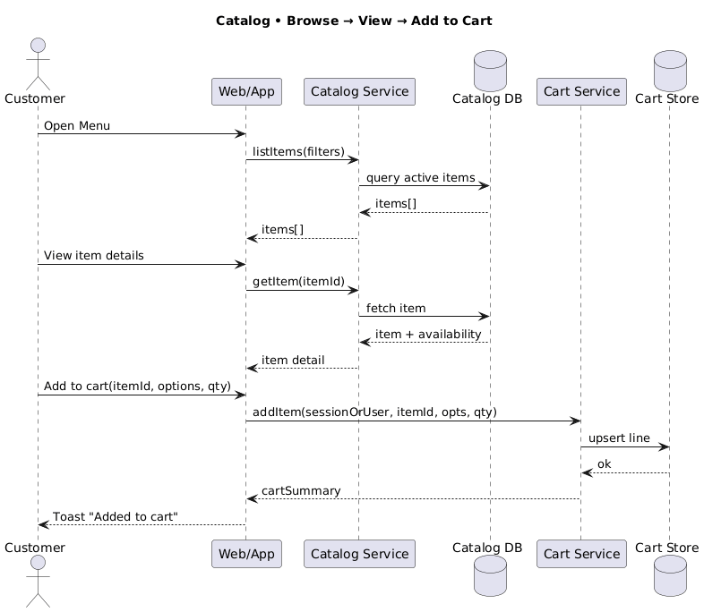
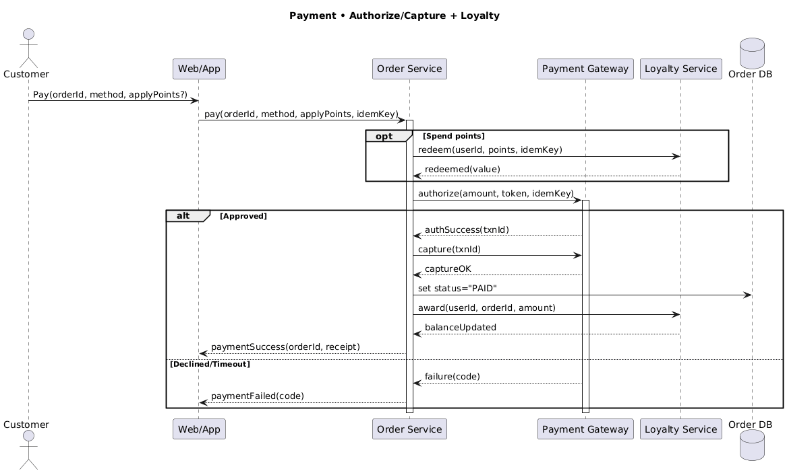
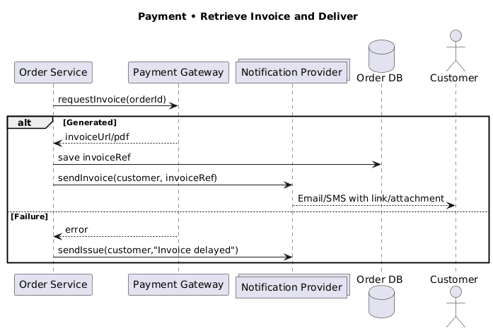
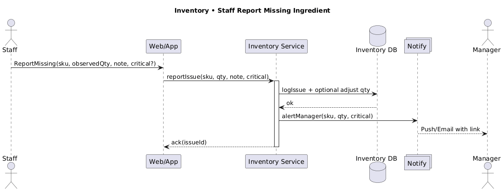

# 0️⃣ Coffee Shop Application - Overview

This Software Engineering 1 project involves building a web application for a **coffee shop** that aims to create a **simple and smooth experience for customers, staff, and administrators**. Customers can easily browse the menu, place orders online or in person, and manage their accounts, including tracking loyalty points and viewing past orders.

Staff can manage orders, monitor preparation progress, and keep an eye on inventory, helping the café run efficiently and ensuring customers are served without delays. Managers and administrators have access to tools for updating the menu, managing promotions and staff accounts, and keeping track of overall business performance, while maintaining security and system reliability.

By integrating ordering, inventory, and management together in one platform, the system makes everyday café operations simpler and more organized. It supports both routine tasks and broader oversight, helping the café run smoothly while providing a convenient and clear experience for everyone involved.

### **In short…**

It’s a **smart coffee shop app** where:

- Customers **order easily** and get rewards
- Staff **know what to make** and when
- Manager **controls the menu and team**
- Admin **keeps it safe, well-documented and updated**

## 👥 About us - Team 6

| Member | GitHub | Role |
|--------|--------|------|
| Eric Damian | [@devian02](https://github.com/devian02) | - |
| Federico Newton | [@fede-oss](https://github.com/fede-oss) | - |
| Anthony Stéphane Stassart | [@7o2y](https://github.com/7o2y) | - |
| Hedi Tebourbi | [@RedPill47](https://github.com/RedPill47) | - |
| Filip Zekonja | [@FilZek04](https://github.com/FilZek04) | - |

---

# 1️⃣ Stakeholders

## Direct Stakeholders

| Stakeholder | Role | Needs |
| --- | --- | --- |
| **Customers** | End users who browse menus, view products, and place orders online. | 1. **Fast & easy access** to menu, prices, and availability. 2. **Accurate** ingredient, allergen, and stock information. 3. **Mobile-responsive** and smooth UX. 4. **High-quality product photos**. 5. **Secure handling** of personal and payment data (GDPR-compliant). |
| **Store Manager** | Manages menu, pricing, promotions, staff, and inventory. | 1. **Intuitive admin dashboard** for menu & availability updates. 2. **Real-time control** over “sold out” or “new item” status. 3. **Confirmation prompts** before deleting items. 4. **Role-based access control** (RBAC) for staff editing. 5. **Bulk updates** via CSV, scheduled menus, and promotions. 6. **Audit trails** for refunds and comps. |
| **Staff** | Serve customers, prepare orders, and report operational issues. | 1. **Real-time menu & stock visibility** to inform customers. 2. **One-tap reporting** of missing ingredients or errors. 3. **Access to prep notes and allergen flags**. 4. **Order queue with priorities** (ASAP vs scheduled). 5. **Status updates** (in-prep, ready, handed over). 6. **Tablet-friendly UI** with large buttons. |
| **System Admin** | Maintains platform stability, security, backups, and documentation. | 1. **Automated daily backups** with recovery options. 2. **Secure access controls** (2FA, HTTPS, RBAC). 3. **Version-controlled deployments** via Git/GitHub. 4. **Comprehensive, up-to-date documentation** (architecture, APIs, guides). |

## Indirect Stakeholders

| Stakeholder | Role | Needs |
| --- | --- | --- |
| **External Payment System** | Processes online transactions securely. | 1. **Secure API integration** with authentication. 2. **Clear transaction status** (success/failure). 3. **PCI-DSS compliance** and data protection. |
| **Hosting Provider** | Hosts the web platform and ensures uptime. | 1. **Stable, monitored server environment**. 2. **Access to logs and performance metrics**. 3. **Real-time alerts** for downtime or issues. |
| **Notification Provider** | Delivers emails, SMS, and push notifications to users and staff. | 1. **Reliable delivery** of transactional and marketing messages. 2. **Support for multiple channels** (email, SMS, push). 3. **High deliverability** and spam compliance. 4. **Template management** and tracking (open/click rates). |

---

# 2️⃣ User Stories

## Customers

- As a customer, I want to **browse the menu**, so that I can see all available items.
- As a customer, I want to **search and filter the menu**, so that I can quickly find what I want.
- As a customer, I want to **view item details**, so that I can see ingredients, price, and availability.
- As a customer, I want to **add items to my cart**, so that I can purchase them.

- As a customer, I want to **place an order**, so that I can complete my purchase.
- As a customer, I want to **checkout as a guest**, so that I can place an order without creating an account.
- As a customer, I want to **choose pickup time or ASAP**, so that I can plan around my schedule.
- As a customer, I want to **make payment**, so that the order is confirmed.
- As a customer, I want to **pay with multiple methods (card, digital wallet, cash on pickup)**, so that I can use my preferred option.
- As a customer, I want my **personal and payment data to be stored securely**, so that I can trust the system.
- As a customer, I want to **receive order confirmation**, so that I know my order is accepted.
- As a customer, I want to **view order info and status**, so that I can track my order.
- As a customer, I want to **cancel my order** (within grace period), so that I can correct mistakes.
- As a customer, I want to **view past orders**, so that I can reorder or check history.
- As a customer, I want to **earn loyalty points** after payment, so that I am rewarded.
- As a customer, I want to **spend loyalty points** at checkout, so that I can get discounts.
- As a customer, I want to **receive invoice**, so that I have proof of purchase.

- As a customer, I want to **register an account**, so that I can access personalized features.
- As a customer, I want to **log in to my account**, so that I can access my profile.
- As a customer, I want to **log out**, so that my session is terminated on the current device.
- As a customer, I want to **view my account details**, so that I can check my information.
- As a customer, I want to **modify my account details**, so that I can update my data.
- As a customer, I want to **delete my account and all data**, so that I can remove my presence.

## Store Manager

- As a manager, I want to **browse staff accounts**, so that I can see all staff members.
- As a manager, I want to **search and filter staff accounts**, so that I can find specific staff.
- As a manager, I want to **view staff account details**, so that I can review permissions and info.
- As a manager, I want to **modify staff accounts**, so that I can update roles or details.
- As a manager, I want to **add or remove staff accounts**, so that I can manage the team.
- As a manager, I want **role templates (barista, supervisor)**, so that onboarding is fast and roles are consistent.

- As a manager, I want to **browse menu items**, so that I can manage menu items.
- As a manager, I want to **add or modify or remove menu items**, so that I can keep the menu updated.
- As a store manager, I want to **mark items as “sold out” in real time**, so that customers see accurate stock info.
- As a manager, I want to **apply promotions** to menu items, so that I can attract more customers.

- As a manager, I want to **browse ingredients**, so that I can manage inventory.
- As a manager, I want to **search and filter ingredients**, so that I can locate stock quickly.
- As a manager, I want to **view ingredient details**, so that I can check usage and stock levels.
- As a manager, I want to **add or modify or remove ingredients**, so that I can update inventory records.
- As a manager, I want to **modify in-stock quantity**, so that I can reflect real stock levels.

- As a manager, I want to **log in to my account**, so that I can access manager features.
- As a manager, I want to **log out**, so that my session is terminated on the current device.

## Staff

- As a staff member, I want to **see the current menu and item availability**, so that I can inform customers correctly.
- As a staff member, I want to **notify missing ingredients**, so that the manager is informed of shortages.

- As a staff member, I want an **order queue with priorities (ASAP vs scheduled)**, so that I can work efficiently.
- As a staff member, I want to **accept or decline orders**, so that I can manage preparation.
- As a staff member, I want to **notify customer about order status updates (in-prep/ready/handed-over)**, so that customers are informed.

- As a staff member, I want to **log in to my account**, so that I can access staff features.
- As a staff member, I want to **log out**, so that my session is terminated on the current device.

### System Admin

- As a system admin, I want to **perform backups**, so that data is safe and recoverable.
- As a system admin, I want to **audit logs**, so that I can monitor system activity.
- As a system admin, I want to **deploy via CI/CD pipelines**, so that the system runs the latest stable version.
- As a system admin, I want to **maintain documentation**, so that the system is well-documented.

---

# **3️⃣ Functional & Non-Functional Requirements**

## Functional Requirements (FR)

### **Customer & Ordering**

| ID | Requirement Description |
| --- | --- |
| **FR-CUS-1** | The system shall allow customers to browse the full menu with search and filtering options (e.g., categories, tags, allergens, dietary labels) accessible on both desktop and mobile. |
| **FR-CUS-2** | Each menu item shall display detailed information, including name, price, description, ingredients, allergen warnings, and optional customizations (e.g., size, add-ons). |
| **FR-CUS-3** | The system shall provide a persistent shopping cart across sessions and allow customers to place orders as guests or registered users. |
| **FR-CUS-4** | The system shall support multiple payment methods (card, digital wallet, cash on pickup), optional tipping, and generate digital receipts/invoices for each order. |
| **FR-CUS-5** | The system shall allow customers to choose pickup time (ASAP or scheduled) within operating hours and receive real-time updates through email, SMS, or push notifications. |
| **FR-CUS-6** | The system shall allow customers to cancel or modify an order within a defined grace period and view real-time order status updates (queued, in preparation, ready, completed). |
| **FR-CUS-7** | The system shall implement a loyalty program that awards points for purchases and allows redemption during checkout for discounts or promotions. |
| **FR-CUS-8** | Customers shall be able to view, edit, or delete their personal data, complying with GDPR and offering secure login, logout, and session handling. |

### **Staff**

| ID | Requirement Description |
| --- | --- |
| **FR-STA-1** | The system shall provide a live order queue showing active and completed orders, sorted by priority (ASAP or scheduled). |
| **FR-STA-2** | Staff shall be able to update order status (in prep, ready, handed over) and report missing ingredients or preparation issues in real time. |
| **FR-STA-3** | The system shall allow staff to mark items as “sold out,” automatically updating visibility for customers and managers. |
| **FR-STA-4** | The system shall support automatic printing of order tickets or labels upon order confirmation. |
| **FR-STA-5** | The system shall include a digital log for recording shift handover notes and pending operational tasks. |

### **Store Manager**

| ID | Requirement Description |
| --- | --- |
| **FR-MGR-1** | The system shall provide an intuitive dashboard for managing menu items, prices, categories, and availability, with inline validation. |
| **FR-MGR-2** | The system shall implement role-based access control (RBAC) to define access levels for staff, managers, and administrators. |
| **FR-MGR-3** | The system shall confirm deletions, perform soft deletes, and maintain version history for menu items and ingredients. |
| **FR-MGR-4** | Managers shall be able to create, schedule, and automatically activate/deactivate promotional offers and menu items. |
| **FR-MGR-5** | The system shall generate analytical summaries (sales trends, top items, prep time averages) exportable as CSV or PDF. |

### **System Administration / Operations**

| ID | Requirement Description |
| --- | --- |
| **FR-OPS-1** | The system shall perform automated encrypted backups with point-in-time recovery and maintain CI/CD version control for deployments. |
| **FR-OPS-2** | The system shall enforce secure access (HTTPS, 2FA for privileged users, strict session management, and RBAC). |
| **FR-OPS-3** | The system shall maintain comprehensive technical documentation for architecture, APIs, and maintenance procedures. |

### **Data and Integrations**

| ID | Requirement Description |
| --- | --- |
| **FR-DATA-1** | All order, payment, and inventory operations shall be atomic and consistent to prevent duplication or loss. |
| **FR-DATA-2** | The system shall log all create, update, and delete operations with timestamps, actor identifiers, and event details. |
| **FR-INT-1** | The system shall integrate with PCI-DSS-compliant payment providers (e.g., Stripe, Square) using secure APIs and idempotent webhooks. |
| **FR-INT-2** | The system shall integrate with external email, SMS, and push notification providers for transactional and marketing messages. |
| **FR-INT-3** | The system shall support integration with local or cloud-connected receipt printers for automatic order ticket generation. |

---

## **Non-Functional Requirements (NFR)**

### **Performance & Scalability**

| ID | Requirement Description |
| --- | --- |
| **NFR-PERF-1** | The system shall maintain page load times below 2.5 seconds and API response times below 700 ms while supporting at least 100 concurrent checkout sessions and 500 concurrent browsing sessions. |
| **NFR-PERF-2** | Real-time updates (order status, stock changes) shall propagate across interfaces within 2 seconds. |

### **Availability & Reliability**

| ID | Requirement Description |
| --- | --- |
| **NFR-AVAIL-1** | The system shall maintain 99.9% uptime and include redundancy/failover through multi-zone hosting. |
| **NFR-AVAIL-2** | All order and payment operations shall ensure transactional integrity and automatic retry in case of partial failure. |

### **Security & Compliance**

| ID | Requirement Description |
| --- | --- |
| **NFR-SEC-1** | The system shall comply with OWASP ASVS Level 2, using TLS 1.2+ and AES encryption for data in transit and at rest. |
| **NFR-SEC-2** | All payments shall be handled by PCI-DSS-compliant providers; no raw card data shall be stored on the platform. |
| **NFR-SEC-3** | The system shall comply fully with GDPR, including user consent, data access/export, and deletion within retention periods. |

### **Observability & Data Integrity**

| ID | Requirement Description |
| --- | --- |
| **NFR-OBS-1** | The platform shall maintain centralized logging and monitoring dashboards for performance metrics, latency, and transaction failures. |
| **NFR-OBS-2** | Audit logs shall record critical actions (create, edit, delete) with timestamps, user IDs, and object references. |

### **User Experience & Accessibility**

| ID | Requirement Description |
| --- | --- |
| **NFR-UX-1** | The system shall comply with WCAG 2.1 AA accessibility standards and adapt responsively across desktop, tablet, and mobile. |

### **Maintainability & Deployment**

| ID | Requirement Description |
| --- | --- |
| **NFR-MAINT-1** | The system shall follow a modular architecture with separate services for authentication, catalog, orders, and payments, supporting API versioning. |
| **NFR-MAINT-2** | Deployments shall use blue-green or canary release strategies for zero-downtime updates. |

### **Integration Standards**

| ID | Requirement Description |
| --- | --- |
| **NFR-INTEG-1** | All integrations shall use authenticated REST or WebSocket APIs with retry and timeout handling for fault tolerance. |

### **Data Consistency**

| ID | Requirement Description |
| --- | --- |
| **NFR-DATA-1** | All critical operations (orders, payments, inventory) shall follow ACID properties for consistency, isolation, and durability. |

---

# **4️⃣ Use Case Diagrams**

## Ordering System Use Case Descriptions

### Use Case: Authenticate

- **Actors**: Customer (primary)
- **Goal/Purpose**: Verify the identity of customers to grant access to the loyalty program.
- **Preconditions**: Customer has a registered account with valid credentials.
- **Main Success Scenario**:
    1. Customer enters username and password or uses two-factor authentication.
    2. System validates credentials against the database.
    3. System grants access to the profile page (where loyalty points are displayed).
- **Alternate flows**:
    - 1a. Invalid credentials: System displays error and allows retry.
    - 2a. Two-factor failure: System resends code or offers alternative method.
- **Postconditions**: Customer is logged in with access to the loyalty program.

### Use Case: Spend Loyalty Points

- **Actors**: Customer (primary)
- **Goal/Purpose**: Allow customers to redeem accumulated loyalty points for discounts or rewards during checkout.
- **Preconditions**: Customer has sufficient loyalty points and an active order.
- **Main Success Scenario**:
    1. Customer selects “Apply Loyalty Points” at checkout.
    2. System checks available points and applicable rewards.
    3. System applies discount and updates points balance.
    4. Customer proceeds with payment.
- **Alternate flows**:
    - 1a. Insufficient points: System notifies customer and suggests earning more.
    - 2a. Reward not applicable: System shows eligible rewards only.
- **Postconditions**: Loyalty points are deducted, and order total is adjusted.

### Use Case: Earn Loyalty Points

- **Actors**: Customer (primary)
- **Goal/Purpose**: Reward customers for completed purchases by crediting loyalty points to their account.
- **Preconditions**: Customer has an account with phone/email linked.
- **Main Success Scenario**:
    1. After successful payment, system calculates points according to some rules.
    2. System credits loyalty account and shows new points balance.
    3. Customer may redeem points at next checkout.
- **Alternate flows**:
    - 1a. Loyalty account missing: system prompts to register.
- **Postconditions**: Loyalty balance updated.

### Use Case: Place Order / Booking

- **Actors**: Customer (primary)
- **Goal/Purpose**: Let customers place an order for selected items and choose pickup or delivery options.
- **Preconditions**: Customer has items in cart.
- **Main Success Scenario**:
    1. Customer proceeds to checkout and selects pickup/delivery and time.
    2. System validates cart (availability, price, promotions).
    3. System calculates totals and shows payment options.
    4. Customer confirms order and triggers payment (next use case).
    5. System creates an order record and reserves items.
- **Alternate flows**:
    - 2a. Item out of stock: system prompts to remove or replace item.
    - 3a. Promotion expired: system recalculates total and informs customer.
- **Postconditions**: Order is created in “pending payment” or “awaiting confirmation” state.

### Use Case: Make Payment

- **Actors**: Customer (primary), Payment System (external)
- **Goal/Purpose**: Process secure payments for customer orders through an external payment gateway.
- **Preconditions**: Order created; payment method selected; payment gateway configured.
- **Main Success Scenario**:
    1. Customer selects payment method and submits payment.
    2. System sends transaction request to Payment System.
    3. Payment System authorizes and confirms payment.
    4. System marks order as “paid” and triggers fulfillment.
- **Alternate flows**:
    - 2a. Payment declined: system shows error and allows retry or change method.
    - 3a. Network error with gateway: system queues payment attempt and notifies the customer.
    - 4a. Payment successful: system extends with “Earn Loyalty Points”.
- **Postconditions**: Payment either completed and order confirmed, or payment failed and order pending/cancelled.

### Use Case: Receive Invoice

- **Actors**: Customer (primary), Payment System (external), Notification Provider (external)
- **Goal/Purpose**: Provide customers with a downloadable VAT-compliant invoice after payment.
- **Preconditions**: Payment is successfully processed.
- **Main Success Scenario**:
    1. System requests invoice from Payment System.
    2. Payment System generates and sends invoice.
    3. System provides download link to customer.
    4. Customer receives email with invoice attachment.
- **Alternate flows**:
    - 2a. Invoice generation fails: System notifies customer and retries.
    - 4a. Email delivery fails: System retries and logs the issue.
- **Postconditions**: Customer receives invoice.

### Use Case: Receive Confirmation

- **Actors**: Customer (primary), Notification Provider (external)
- **Goal/Purpose**: Notify customers of successful order placement/cancellation through email/SMS.
- **Preconditions**: Order confirmed and/or paid, or order successfully cancelled.
- **Main Success Scenario**:
    1. System sends confirmation message to Notification Provider (email/SMS).
    2. Notification System delivers confirmation to the customer.
    3. Customer receives order number, pickup ETA, or cancel confirmation.
- **Alternate flows**:
    - 2a. Notification delivery fails: system retries and logs the failure.
- **Postconditions**: Customer is informed; system logs notification.

### Use Case: View Order Info & Status

- **Actors**: Customer (primary)
- **Goal/Purpose**: Enable customers to check the current status and details of their active orders.
- **Preconditions**: Customer has an active or pending order.
- **Main Success Scenario**:
    1. Customer selects “View Order Status”.
    2. System displays order number, items, total, and status (e.g., queued, in prep, ready).
    3. Customer acknowledges the information.
- **Alternate flows**:
    - 2a. Status update delay: System shows last known status with a “refresh” option.
    - 3a. Order not found: System prompts to check order number.
- **Postconditions**: Customer is informed of order progress.

### Use Case: Cancel Order

- **Actors**: Customer (primary)
- **Goal/Purpose**: Allow customers to cancel an order within a specified grace period before preparation.
- **Preconditions**: Order is in “pending” or “queued” state and within cancellation window.
- **Main Success Scenario**:
    1. Customer selects “Cancel Order” from order details.
    2. System verifies cancellation eligibility.
    3. System cancels order, refunds payment (if paid), and notifies staff.
- **Alternate flows**:
    - 1a. Outside grace period: System denies cancellation and explains policy.
    - 2a. Payment refund issue: System queues refund and notifies customer.
- **Postconditions**: Order is cancelled, and resources are released.

### Use Case: View Past Orders

- **Actors**: Customer (primary)
- **Goal/Purpose**: Allow customers to review their previous orders, receipts, and re-order items easily.
- **Preconditions**: Customer has prior orders or is authenticated (for persistence).
- **Main Success Scenario**:
    1. Customer opens order history.
    2. System lists previous orders, statuses, and receipts.
    3. Customer can reorder or view receipt details.
- **Alternate flows**:
    - 1a. No history: system shows “no past orders” message.
- **Postconditions**: Customer can access past order info.

### Use Case: Notify Staff About New Orders and Cancelled Orders

- **Actors**: Staff/Manager (primary), Notification System (external)
- **Goal/Purpose**: Inform staff about new or cancelled orders for timely action.
- **Preconditions**: New order is placed or an existing order is cancelled.
- **Main Success Scenario**:
    1. System detects new or cancelled order.
    2. System sends notification to staff dashboard or Notification System.
    3. Staff receives alert with order details.
- **Alternate flows**:
    - 2a. Notification failure: System retries and logs the issue.
    - 3a. Staff offline: System queues notification for next login.
- **Postconditions**: Staff is aware of order status changes.

### Use Case: Accept or Decline Order

- **Actors**: Staff/Manager (primary)
- **Goal/Purpose**: Allow staff or manager to approve or reject an order based on availability or policy.
- **Preconditions**: New order is in “pending” state.
- **Main Success Scenario**:
    1. Staff/Manager reviews order details.
    2. Staff/Manager selects “Accept” or “Decline” with reason (if declined).
    3. System updates order status and notifies customer.
- **Alternate flows**:
    - 2a. Item unavailable: System suggests alternatives before declining.
    - 3a. Notification delay: System queues update and retries.
- **Postconditions**: Order is accepted or declined with customer informed.

### Use Case: Notify Customer about Order Status Update

- **Actors**: Customer (primary), Notification System (external)
- **Goal/Purpose**: Update customers on order progress (e.g., in prep, ready) via their preferred channel.
- **Preconditions**: Order status changes (e.g., from queued to in prep).
- **Main Success Scenario**:
    1. System detects status change.
    2. System sends update via Notification System (email/SMS/push).
    3. Customer receives updated ETA or status.
- **Alternate flows**:
    - 2a. Customer preferences not set: System uses default channel.
    - 3a. Delivery failure: System logs and retries.
- **Postconditions**: Customer is updated on order status.

## **Authentication System Use Case Descriptions**

### Use Case: Register an Account

- **Actors**: Customers (primary), Notification Provider (external)
- **Goal/Purpose**: Allow new customers to create an account in the system to access personalized features such as order history and loyalty points.
- **Preconditions**: The customer does not have an existing account; email address is valid and unique.
- **Main Success Scenario**:
    1. Customer selects “Register” and enters required details (name, email, password, phone).
    2. System validates input format and checks for duplicate email.
    3. System creates the account and generates a confirmation token.
    4. System sends a registration confirmation email via Notification Provider.
    5. Customer clicks the confirmation link to activate the account.
- **Alternate flows**:
    - 2a. Invalid input: System highlights errors and prompts correction.
    - 2b. Email already in use: System prompts to log in or reset password.
    - 4a. Email delivery fails: System retries up to 3 times and logs the issue.
    - 5a. Confirmation link expired: Customer requests a new link.
- **Postconditions**: Customer account is created and activated; welcome email is sent.

### Use Case: View Account Details

- **Actors**: Customers (primary)
- **Goal/Purpose**: Allow authenticated customers to view their personal account information.
- **Preconditions**: Customer is logged into the system.
- **Main Success Scenario**:
    1. Customer navigates to “My Account” section.
    2. System retrieves and displays account details (name, email, phone, loyalty points, order history link).
    3. Customer reviews the information.
- **Alternate flows**:
    - 2a. Data retrieval error: System shows cached data with “refresh” option.
- **Postconditions**: Customer views current account profile.

### Use Case: Modify Account Details

- **Actors**: Customers (primary)
- **Goal/Purpose**: Enable customers to update their personal information such as name, phone, or password.
- **Preconditions**: Customer is logged in; “View Account Details” is active.
- **Main Success Scenario**:
    1. Customer selects “Edit Profile” from account page.
    2. System displays editable form with current values.
    3. Customer modifies desired fields and submits.
    4. System validates changes and updates the database.
    5. System confirms successful update.
- **Alternate flows**:
    - 3a. Invalid input (e.g., weak password): System shows validation errors.
    - 4a. Email change requested: System requires re-verification via Notification Provider.
- **Postconditions**: Account details are updated in the system.

### Use Case: Delete my account and all my Data

- **Actors**: Customers (primary)
- **Goal/Purpose**: Allow customers to permanently delete their account and associated data in compliance with privacy regulations (e.g., GDPR).
- **Preconditions**: Customer is logged in; no active orders or subscriptions.
- **Main Success Scenario**:
    1. Customer selects “Delete Account” from settings.
    2. System displays warning about irreversible data loss.
    3. Customer confirms deletion after re-authentication (password or 2FA).
    4. System anonymizes or deletes all personal data and account.
    5. System logs out the user and shows confirmation.
- **Alternate flows**:
    - 1a. Active orders exist: System blocks deletion and prompts to cancel orders first.
    - 3a. Re-authentication fails: System cancels process.
- **Postconditions**: Account and all personal data are permanently removed.

### Use Case: Logout

- **Actors**: Customers (primary), Staff (primary), Manager (primary)
- **Goal/Purpose**: Securely end the user session and revoke access tokens.
- **Preconditions**: User is currently logged into the system.
- **Main Success Scenario**:
    1. User selects “Logout” from navigation menu.
    2. System invalidates session token and clears client-side authentication.
    3. System redirects user to the login or homepage.
- **Alternate flows**:
    - 2a. Session already expired: System automatically logs out on next action.
- **Postconditions**: User is logged out; session is terminated.

### Use Case: Login into my Account

- **Actors**: Customers (primary), Staff (primary), Manager (primary)
- **Goal/Purpose**: Allow registered users to authenticate and access their account.
- **Preconditions**: User has a registered and active account.
- **Main Success Scenario**:
    1. User enters email and password on login page.
    2. System verifies credentials against stored hash.
    3. System generates session token and grants access to role-based dashboard.
- **Alternate flows**:
    - 2a. Incorrect credentials: System shows error; allows retry (max 5 attempts).
    - 2b. Account locked: System displays lockout message and recovery instructions.
    - 2c. Two-factor enabled: System sends 2FA code via Notification Provider.
- **Postconditions**: User is authenticated and redirected to appropriate interface.

### Use Case: Delete Customer Account and all their Data

- **Actors**: Manager (primary)
- **Goal/Purpose**: Allow managers to remove a customer account and all associated data (e.g., for compliance or support requests).
- **Preconditions**: Manager is authenticated with admin privileges; customer account exists.
- **Main Success Scenario**:
    1. Manager searches for customer by email or ID in admin panel.
    2. Manager selects “Delete Customer Account”.
    3. System displays confirmation with data summary (orders, loyalty, etc.).
    4. Manager confirms deletion.
    5. System permanently removes all customer data and logs action.
- **Alternate flows**:
    - 3a. Active subscriptions/orders: System requires cancellation first.
    - 5a. Deletion fails: System logs error and notifies manager.
- **Postconditions**: Customer account and data are fully erased; audit trail recorded.

## **Account Management System Use Case Descriptions**

### Use Case: Browse Staff Accounts

- **Actors**: Manager (primary)
- **Goal/Purpose**: Allow the manager to view a list of all staff accounts in the system.
- **Preconditions**: Manager is authenticated with appropriate permissions.
- **Main Success Scenario**:
    1. Manager navigates to the "Staff Accounts" section in the admin panel.
    2. System retrieves and displays a list of all staff accounts.
    3. Each entry shows name, role, email, status (active/inactive), and last login.
    4. Manager reviews the list.
- **Alternate flows**:
    - 2a. No staff accounts exist: System displays “No staff accounts found” with option to add new.
    - 3a. Data load delay: System shows loading indicator and cached list if available.
- **Postconditions**: Manager views current staff account overview.

### Use Case: Search & Filter Staff Accounts

- **Actors**: Manager (primary)
- **Goal/Purpose**: Enable the manager to quickly locate specific staff accounts using search or filters.
- **Preconditions**: “Browse Staff Accounts” is active; at least one staff account exists.
- **Main Success Scenario**:
    1. Manager enters a search term (name, email) or selects filters (role, status).
    2. System applies filters and updates the staff list in real time.
    3. System highlights matching results and shows count of filtered items.
    4. Manager selects a staff member to view details.
- **Alternate flows**:
    - 1a. No matches found: System displays “No results” with suggestion to clear filters.
    - 2a. Filter error: System resets to default view and logs issue.
- **Postconditions**: Staff list is filtered according to criteria.

### Use Case: View Staff Account Details

- **Actors**: Manager (primary)
- **Goal/Purpose**: Display detailed information about a specific staff member’s account.
- **Preconditions**: Manager has selected a staff account from the list.
- **Main Success Scenario**:
    1. Manager clicks on a staff member from the list.
    2. System displays detailed profile: full name, email, phone, role, permissions, join date, last login, and account status.
    3. System shows action buttons (Edit, Disable, Delete).
    4. Manager reviews the information.
- **Alternate flows**:
    - 2a. Missing data (e.g., phone): System shows “Not provided”.
- **Postconditions**: Full staff account details are displayed.

### Use Case: Modify Staff Account

- **Actors**: Manager (primary)
- **Goal/Purpose**: Allow the manager to update staff account information or permissions.
- **Preconditions**: "View Staff Account Details" is active; manager has edit permissions.
- **Main Success Scenario**:
    1. Manager clicks “Edit” on the staff detail page.
    2. System loads editable form with current values.
    3. Manager updates fields (name, email, role, permissions, status).
    4. System validates changes and saves to the database.
    5. System confirms update and refreshes the view.
- **Alternate flows**:
    - 3a. Invalid email format: System highlights error and prevents submission.
- **Postconditions**: Staff account is updated with new information.

### Use Case: Add / Remove Staff Accounts

- **Actors**: Manager (primary)
- **Goal/Purpose**: Enable the manager to create new staff accounts or permanently delete existing ones.
- **Preconditions**: Manager is authenticated with full admin privileges.
- **Main Success Scenario (Add)**:
    1. Manager clicks “Add Staff” from the staff list.
    2. System displays a form for new staff details (name, email, role, temporary password).
    3. Manager fills in details and submits.
    4. System creates the account, sends welcome email via Notification Provider, and adds to list.
    5. New staff receives login instructions.
    
    **Main Success Scenario (Remove)**:
    
    1. Manager selects “Delete” from staff details.
    2. System shows confirmation dialog with warning about irreversible action.
    3. Manager confirms deletion.
    4. System deactivates account, removes personal data (if required), and logs action.
- **Alternate flows**:
    - **Add**:
        - 3a. Email already in use: System prevents creation and suggests login reset.
        - 4a. Email delivery fails: System logs and allows manual resend.
    - **Remove**:
        - 1a. Staff has active sessions: System forces logout before deletion.
        - 3a. Deletion restricted (e.g., last admin): System blocks and shows error.
- **Postconditions**:
    - **Add**: New staff account is created and active.
    - **Remove**: Staff account is permanently removed or deactivated.

## **Listings System Use Case Descriptions**

### Use Case: Browse Menu

- **Actors**: Customer (primary), Manager (primary)
- **Goal/Purpose**: Allow customers and managers to view the complete list of available menu items in an organized and accessible way.
- **Preconditions**: At least one menu item is active and published.
- **Main Success Scenario**:
    1. Customer/Manager navigates to the menu page.
    2. System retrieves and displays all active menu items grouped by categories (e.g., Coffee, Pastries, Beverages).
    3. Each item shows thumbnail, name, short description, price, and availability indicator.
    4. Customer/Manager scrolls through the menu and selects an item to view details.
- **Alternate flows**:
    - 2a. No items available: System displays “Menu temporarily unavailable” with fallback message.
    - 3a. Slow load: System shows skeleton placeholders and loads items progressively.
- **Postconditions**: Customer/Manager sees current menu with up-to-date items and pricing.

### Use Case: Search & Filter Menu

- **Actors**: Customer (primary), Manager (primary)
- **Goal/Purpose**: Enable customers/managers to quickly locate specific items using search keywords or filters.
- **Preconditions**: "Browse Menu" is active; menu contains indexed attributes (tags, allergens, category).
- **Main Success Scenario**:
    1. Customer/Manager enters a search term or applies filters (e.g., Vegan, Gluten-Free, Hot Drinks,, Price Range).
    2. System dynamically filters the menu in real time.
    3. System displays matching items with result count and active filter badges.
    4. Customer/manager selects an item from the filtered list.
- **Alternate flows**:
    - 1a. No results: System shows “No items match your criteria” with filter reset option.
    - 2a. Filter conflict: System disables incompatible options and informs user.
- **Postconditions**: Menu is filtered to show only relevant items.

### Use Case: View Item Details

- **Actors**: Customer (primary), Manager (primary)
- **Goal/Purpose**: Provide comprehensive information about a selected menu item to support informed purchasing decisions or allow manager to access edit functionalities.
- **Preconditions**: Customer/Manager has selected selected an item from the menu.
- **Main Success Scenario**:
    1. Customer/Manager clicks on a menu item.
    2. System displays full item page with:
        - High-resolution photos
        - Full description
        - Ingredients and allergen warnings
        - Price (with size variations if applicable)
        - Customization options (e.g., milk type, grind size)
        - Availability status
        - Add to Cart button (for customer only)
    3. Customer reviews details and decides to add to cart.
- **Alternate flows**:
    - 2a. Item sold out: System disables “Add to Cart” and shows estimated restock time.
    - 2b. Missing photo: System shows placeholder with item name.
- **Postconditions**: Customer/Manager has full context about the item; customer may proceed to cart; manager may proceed to edit/delete.

### Use Case: Add Item to Cart

- **Actors**: Customer (primary)
- **Goal/Purpose**: Allow customers to select items for purchase by adding them to a persistent shopping cart.
- **Preconditions**: Item is in stock; customer is on item details page.
- **Main Success Scenario**:
    1. Customer configures options (size, quantity, customizations).
    2. Customer clicks “Add to Cart”.
    3. System validates selections and adds item to cart (session or account-based).
    4. System updates cart icon with item count and shows confirmation toast.
    5. Customer may continue browsing or proceed to checkout.
- **Alternate flows**:
    - 1a. Invalid combination (e.g., decaf + espresso): System shows error and suggests correction.
    - 3a. Item becomes unavailable mid-action: System removes and notifies customer.
- **Postconditions**: Item is securely added to cart; total updated.

### Use Case: Add / Modify / Remove Menu Items

- **Actors**: Manager (primary)
- **Goal/Purpose**: Enable the manager to add or update or delete menu items to reflect real-world availability and offerings.
- **Preconditions**: Manager is authenticated with edit permissions.
- **Main Success Scenario (Add)**:
    1. Manager navigates to “Menu Management” in admin panel.
    2. Manager clicks to create a new item.
    3. System loads empty editable form.
    4. Manager adds name, price, description, ingredients, photos, and availability.
    5. System saves changes and updates live menu instantly.
    
    **Main Success Scenario (Modify)**:
    
    1. Manager navigates to “Menu Management” in admin panel.
    2. Manager selects an item to edit.
    3. System loads editable form with current values.
    4. Manager updates name, price, description, ingredients, photos, and availability.
    5. System saves changes and updates live menu instantly.
    
    **Main Success Scenario (Remove)**:
    
    1. Manager selects “Delete” on a menu item.
    2. System shows confirmation with warning (e.g., “This will hide item from customers”).
    3. Manager confirms.
    4. System soft-deletes or archives the item and removes from public view.
- **Alternate flows**:
    - **Modify**:
        - 4a. Price change during active orders: System logs and applies to new orders only.
    - **Remove**:
        - 1a. Item in active cart: System allows removal but notifies affected customers.
        - 3a. Last item in category: System warns about empty category display.
- **Postconditions**:
    - **Add**: Menu item reflects updated information.
    - **Modify**: Menu item reflects updated information.
    - **Remove**: Item is no longer visible to customers.

### Use Case: Apply Promotions

- **Actors**: Manager (primary)
- **Goal/Purpose**: Allow the manager to create and attach promotional offers to menu items or categories.
- **Preconditions**: Promotion rules are configured.
- **Main Success Scenario**:
    1. Manager opens promotion settings on an item or category.
    2. Manager selects promotion type (e.g., % off, BOGO, happy hour).
    3. Manager sets conditions (time, minimum spend, customer segment).
    4. System validates logic and activates promotion.
    5. Promotion badge appears on menu item for eligible customers.
- **Alternate flows**:
    - 3a. Overlapping promotions: System prioritizes or merges rules and warns manager.
    - 4a. Scheduled promotion: System auto-activates/deactivates at set times.
- **Postconditions**: Promotion is live and applied correctly during checkout.

## **Inventory System Use Case Descriptions**

### Use Case: Browse Ingredients

- **Actors**: Manager (primary)
- **Goal/Purpose**: Allow the manager to view a complete list of all ingredients used in menu items.
- **Preconditions**: Manager is authenticated; at least one ingredient is registered in the system.
- **Main Success Scenario**:
    1. Manager navigates to the "Inventory" section in the admin panel.
    2. System displays a table of all ingredients with columns: name, current stock, unit, supplier, last updated.
    3. Manager scrolls and reviews the list.
- **Alternate flows**:
    - 2a. No ingredients registered: System shows “No ingredients found” with prompt to add.
    - 3a. Slow loading: System displays skeleton rows and loads data progressively.
- **Postconditions**: Manager sees current inventory overview.

### Use Case: Search & Filter Ingredients

- **Actors**: Manager (primary)
- **Goal/Purpose**: Enable the manager to quickly find specific ingredients using search or filters.
- **Preconditions**: "Browse Ingredients" is active; ingredient list is populated.
- **Main Success Scenario**:
    1. Manager enters a search term (e.g., “milk”, “arabica”) or applies filters (low stock, supplier, category).
    2. System filters the list in real time and updates the display.
    3. System shows result count and active filter tags.
    4. Manager selects an ingredient to view details.
- **Alternate flows**:
    - 1a. No matches: System displays “No ingredients match your search” with clear filter option.
    - 2a. Filter error: System resets to default view and logs issue.
- **Postconditions**: Ingredient list is filtered according to criteria.

### Use Case: View Ingredient Details

- **Actors**: Manager (primary)
- **Goal/Purpose**: Provide detailed information about a specific ingredient including stock history and usage.
- **Preconditions**: Manager has selected an ingredient from the list.
- **Main Success Scenario**:
    1. Manager clicks on an ingredient row.
    2. System displays detailed view including:
        - Name, SKU, unit (kg, L, units)
        - Current stock level
        - Reorder threshold
        - Supplier info
        - Last restock date
        - Usage in menu items (linked list)
        - Stock history chart (optional)
    3. Manager reviews the information.
- **Alternate flows**:
    - 2a. No usage data: System shows “Not used in any menu item”.
    - 2b. Missing supplier: System shows “No supplier assigned”.
- **Postconditions**: Full ingredient profile is displayed.

### Use Case: Add / Modify / Remove Ingredients

- **Actors**: Manager (primary)
- **Goal/Purpose**: Allow the manager to register new ingredients or remove obsolete ones from inventory.
- **Preconditions**: Manager has edit permissions.
- **Main Success Scenario (Add)**:
    1. Manager clicks “Add Ingredient” in inventory panel.
    2. System shows form: name, unit, reorder level, quantity, etc...
    3. Manager fills in details and submits.
    4. System verifies uniqueness and adds ingredient.
    5. Ingredient appears in the list.
    
    **Main Success Scenario (Modify)**:
    
    1. Manager selects “Modify” on an ingredient.
    2. System shows form: name, unit, reorder level, quantity, etc...
    3. Manager edits the details and submits.
    4. System verifies uniqueness and adds ingredient.
    5. Ingredient appears in the list.
    
    **Main Success Scenario (Remove)**:
    
    1. Manager selects “Delete” on an ingredient.
    2. System checks if ingredient is used in active menu items.
    3. If not in use: System shows confirmation and removes ingredient.
    4. If in use: System blocks deletion and suggests archiving.
- **Alternate flows**:
    - **Add**:
        - 3a. Name already exists: System prevents duplicate and suggests edit.
    - **Modify**:
        - 3a. Name already exists: System prevents duplicate.
    - **Remove**:
        - 2a. In use by menu item: System requires removal from recipes first.
        - 3a. Soft delete: System archives instead of permanent removal.
- **Postconditions**:
    - **Add**: New ingredient is registered and available for stock updates.
    - **Modify**: New ingredient is registered and available for stock updates.
    - **Remove**: Ingredient is no longer active in inventory.

### Use Case: Modify In-Stock Quantity

- **Actors**: Manager (primary)
- **Goal/Purpose**: Update the current stock level of an ingredient after restock or usage.
- **Preconditions**: "Add / Remove Ingredients" or "View Ingredient Details" is active.
- **Main Success Scenario**:
    1. Manager opens ingredient details or uses inline edit in list.
    2. Manager enters new quantity or adjusts via +/− buttons.
    3. System prompts for reason (restock, waste, correction).
    4. Manager submits change.
    5. System updates stock, logs transaction, and recalculates low-stock alerts.
- **Alternate flows**:
    - 2a. Negative adjustment exceeds stock: System warns and requires confirmation.
    - 3a. Bulk update: Manager uploads CSV for multiple adjustments.
    - 5a. Threshold breached: System auto-triggers reorder suggestion.
- **Postconditions**: Ingredient stock is accurately updated; audit trail recorded.

### Use Case: Notify Missing Ingredients

- **Actors**: Staff (primary)
- **Goal/Purpose**: Allow staff to report when an ingredient is physically missing or below usable level during operations.
- **Preconditions**: Staff is authenticated; ingredient exists in system.
- **Main Success Scenario**:
    1. Staff opens the “Report Issue” or inventory quick-access panel.
    2. Staff searches for or selects the missing ingredient.
    3. Staff enters observed quantity (e.g., “0” or “spilled”) and optional note.
    4. System logs the report, updates stock if confirmed, and notifies manager.
    5. Manager receives alert in dashboard.
- **Alternate flows**:
    - 2a. Ingredient not found: Staff uses “Report Unknown Item” free-text form.
    - 4a. Auto-adjust disabled: System flags for manager approval only.
    - 5a. Urgent flag: Staff marks as “critical” to escalate notification.
- **Postconditions**: Missing ingredient is reported; manager is informed for action.

## **Internal Management System Use Case Descriptions**

### Use Case: Perform Backups

- **Actors**: System Admin (primary)
- **Goal/Purpose**: Ensure data integrity and availability by creating regular, recoverable backups of the system.
- **Preconditions**: System Admin is authenticated with full administrative access; backup storage is configured and accessible.
- **Main Success Scenario**:
    1. System Admin navigates to the "Backup Management" section.
    2. System Admin selects "Create Backup" (manual) or verifies scheduled backup is active.
    3. System initiates full or incremental backup of database, files, and configurations.
    4. System compresses and encrypts the backup.
    5. System transfers backup to secure offsite storage.
    6. System logs backup completion with timestamp and checksum.
- **Alternate flows**:
    - 3a. Backup fails (e.g., storage full): System retries up to 3 times and alerts admin.
    - 4a. Encryption key missing: System prompts for key or uses default.
    - 5a. Network interruption: System resumes transfer from last checkpoint.
- **Postconditions**: A verified, encrypted backup is securely stored; log entry created.

### Use Case: Audit Logs

- **Actors**: System Admin (primary)
- **Goal/Purpose**: Review system activity logs to monitor security, troubleshoot issues, and ensure compliance.
- **Preconditions**: System Admin is authenticated; logging is enabled and logs are retained.
- **Main Success Scenario**:
    1. System Admin accesses the "Audit Logs" dashboard.
    2. System displays log entries with filters: date range, user, action type, severity.
    3. System Admin applies filters (e.g., "failed logins", "manager actions").
    4. System shows detailed log entries: timestamp, user ID, IP, action, outcome.
    5. System Admin exports logs if needed (CSV/PDF).
- **Alternate flows**:
    - 2a. No logs in range: System displays “No activity found”.
    - 4a. High volume: System paginates results and offers real-time streaming.
    - 5a. Export fails: System retries and notifies admin.
- **Postconditions**: Admin has reviewed and/or exported relevant system activity.

### Use Case: Deploy Updates

- **Actors**: System Admin (primary)
- **Goal/Purpose**: Safely apply software updates, patches, or new features to the live system with minimal downtime.
- **Preconditions**: System Admin has access to version control (Git); update package is tested in staging.
- **Main Success Scenario**:
    1. System Admin pulls latest approved changes from version control.
    2. System runs pre-deployment checks (database migrations, dependency compatibility).
    3. System puts system in maintenance mode (if required).
    4. System deploys update: builds assets, runs migrations, restarts services.
    5. System runs smoke tests and health checks.
    6. System removes maintenance mode and logs deployment success.
- **Alternate flows**:
    - 2a. Migration conflict: System halts and prompts manual resolution.
    - 4a. Service fails to restart: System triggers rollback to previous version.
    - 5a. Health check fails: System reverts and notifies admin via alert.
- **Postconditions**: System is running the latest stable version; deployment logged.

### Use Case: Maintain Documentation

- **Actors**: System Admin (primary)
- **Goal/Purpose**: Keep system architecture, API, and operational documentation accurate and up-to-date for onboarding and maintenance.
- **Preconditions**: System Admin has edit access to documentation repository (e.g., Git-based wiki or CMS).
- **Main Success Scenario**:
    1. System Admin opens the documentation portal.
    2. System Admin selects a section to update (e.g., API endpoints, deployment guide).
    3. System Admin edits content using markdown or rich text editor.
    4. System Admin previews changes and submits.
    5. System commits changes to version control and publishes updated docs.
    6. System notifies relevant team members (optional).
- **Alternate flows**:
    - 3a. Schema change detected: System suggests updating ER diagram.
    - 5a. Publish fails: System saves draft and retries.
    - 6a. Auto-generate: System pulls API specs from code (e.g., OpenAPI) and updates docs.
- **Postconditions**: Documentation reflects current system state; versioned and accessible.

---

# 5️⃣ Domain Diagrams

---

# 5️⃣ Sequence Diagrams (Behavioral Aspects)

